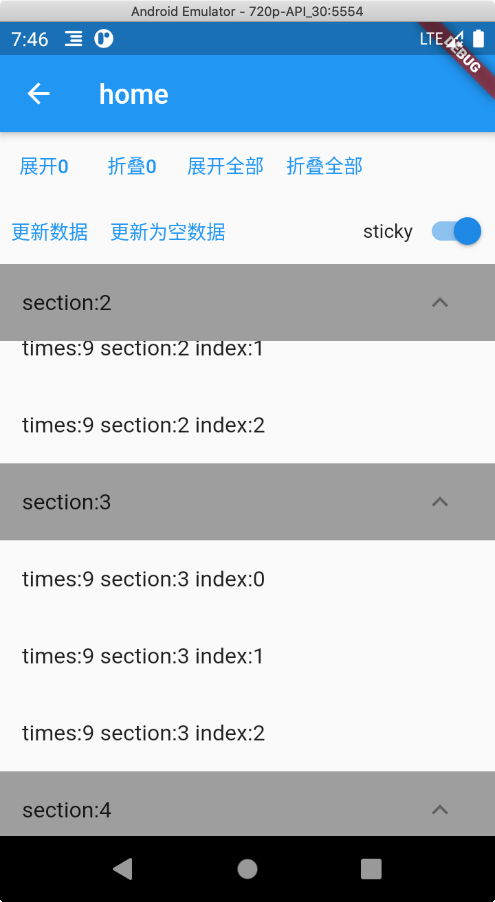

[TOC]

flutter expendable listview sticky

# ExpendableListView 主要功能

#### 1. 点击折叠展开功能，section里多个child不卡顿

我看到大多类库是用ListView+colum(children[]) 实现的，如果section的child比较多就会出现卡顿，比如ListView+ExpansionTile

#### 2. 支持吸顶header

## 导入方式

暂未发布到pub上

	  flutter_expendable_listview:
	    git:
	      url: git://github.com/LuckyJayce/flutter_expendable_listview.git

## 使用方式:

1. ExpendableListView添加到界面上

  ```
  ExpendableListView(
    sticky: sticky,
    delegate: MyListDelegate(data),
  )
  ```

2. 自定义ExpendableListDelegate

	
	
	```
	class MyListDelegate implements ExpendableListDelegate {
	  List<List<String>> data = [];
	
	  MyListDelegate(this.data);
	
	  @override
	  int getSectionChildCount(int sectionIndex) {
	    return data[sectionIndex].length;
	  }
	
	  @override
	  int getSectionCount() {
	    return data.length;
	  }
	
	  @override
	  Widget buildSectionHeader(BuildContext context, int sectionIndex, bool expended) {
	    return Container(
	      decoration: BoxDecoration(color: Colors.grey),
	      child: ListTile(
	          title: Text('section:$sectionIndex'),
	          trailing: ExpandIcon(
	            // ValueKey(sectionIndex) 可以变为floatHeader导致重新执行动画
	            key: ValueKey(sectionIndex),
	            isExpanded: expended,
	            onPressed: null,
	          )),
	    );
	  }
	
	  @override
	  Widget buildSectionChild(BuildContext context, int sectionIndex, int childIndex) {
	    return ListTile(
	      title: Text(data[sectionIndex][childIndex]),
	    );
	  }
	}
	```

## 效果图 ##    

